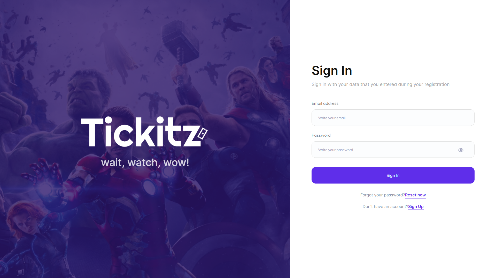

<h1 align="center">Tickie Website</h1>
<h4 align="center">Tickie is a website-based application that can help users in getting the latest fillm information and making online bookings and payment.</h4>

<hr>

## Built With

- [React JS](https://reactjs.org/)
- [Bootstrap](https://getbootstrap.com)
- [Node JS](https://nodejs.org/)
- [Redux](https://redux.js.org/)

## How to run the app ?

- Clone Repositories

```
https://github.com/luthfidiqi/Tickie-Frontend.git
```

- Intall NPM Package

```
npm install
```

- Set up .env file

```
REACT_APP_URL_BE=
REACT_APP_URL_CLOUDINARY=
```

- Start The Project

```
npm start
```

## Demo

### Link Website : [https://tickie.vercel.app/]

<hr>

<div display="flex">



</div>

<hr>

## License

© [Luthfi Thufail Asiddiqi](https://github.com/luthfidiqi/)
